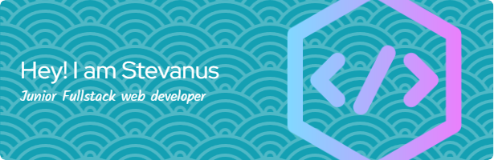

<!--
**BlackGhost-ID/blackghost-id** is a ✨ _special_ ✨ repository because its `README.md` (this file) appears on your GitHub profile.

Here are some ideas to get you started:

- 🔭 I’m currently working on ...
- 🌱 I’m currently learning ...
- 👯 I’m looking to collaborate on ...
- 🤔 I’m looking for help with ...
- 💬 Ask me about ...
- 📫 How to reach me: ...
- 😄 Pronouns: ...
- ⚡ Fun fact: ...
-->

  

###

##### 🧑‍💻 About Me

- 🔭 I’m currently working on **Website for 7icons**
- 🌱 I’m currently learning **Discord.js**
- ⚡ Fun fact: **I ❤️ Anime**
- 😄 Pronouns: **He/Him**

##### 🛠️ Languages & Tools

##### My Spotify List

  

###

##### My Github Stats

##### 📫 Connect With Me

    

###
